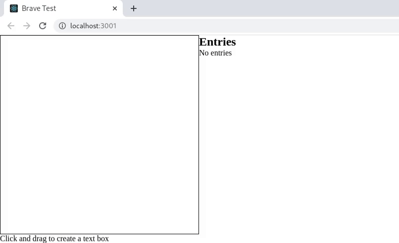

# Vaga React Brave

## O Desafio

O desafio consiste em desenvolver uma aplicação que permita criar caixas de textos com o mouse conforme exemplo acima.

## Funcionalidades

- A aplicação deve permitir a criação de caixas de texto com o mouse **(clique, segure, arraste e solte para criar)**.
- A aplicação deve mostrar um preview da caixa de texto que será criada.
- A aplicação deve permitir a edição de textos das caixas de texto já criadas.
- A aplicação deve permitir a remoção de caixas de texto criadas (opcional)

Dica: **Não se preocupe com o estilo da aplicação, não será avaliado. Somente a funcionalidade.**

## Requisitos

- **Desenvolver em React**
- _Desenvolvimento de testes unitários (opcional mas é um **grande diferencial**)_ \*
- _Redux (opcional mas é um diferencial)_

Dica: **Pointer Events**

\* Pode utilizar qualquer framework de teste, **porém não esqueça de documentar como rodar!**

## Instruções do desafio

1. Crie um fork do repositório para sua conta no GitHub
2. Crie uma branch com seu nome **(Ex. nome_sobrenome)**
3. Desenvolva
4. Crie uma pull request para o nosso repositório

## O que será avaliado?

- Funcionamento
- Clareza do código
- Manutenabilidade
- Histórico de commits
- Boas práticas

Dica: **Use algum linter!**

**Não esqueça de documentar como rodar sua aplicação e os testes!**

